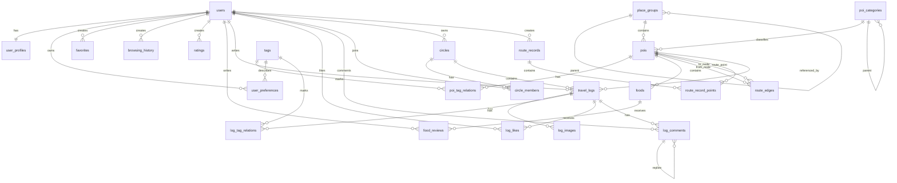

# E-R 图说明

下面的 Mermaid 图展示数据库核心实体关系。可复制到支持 Mermaid 的 Markdown 编辑器中预览。

## 关系解释

- `users` 与 `user_profiles` 是一对一关系，账号信息和展示资料分离。
- `place_groups` 是通用空间分组，可表示高校、校区、景区、公园、商圈等。
- `pois` 是地点核心表，通过 `place_groups` 表示空间归属，通过 `poi_categories` 表示类型，通过 `tags` 表示兴趣特征。
- `pois` 与 `route_edges` 构成路线图，POI 是节点，路线边是边。
- `travel_logs` 同时支持个人游记和圈子日志：
  - `circle_id` 为空时表示个人游记。
  - `circle_id` 不为空时表示圈子日志。
- `log_likes`、`log_comments`、`favorites`、`browsing_history`、`ratings` 共同构成用户行为数据。
- `user_preferences` 可以来自用户手动选择，也可以由浏览、收藏、点赞、评论、评分等行为沉淀。
